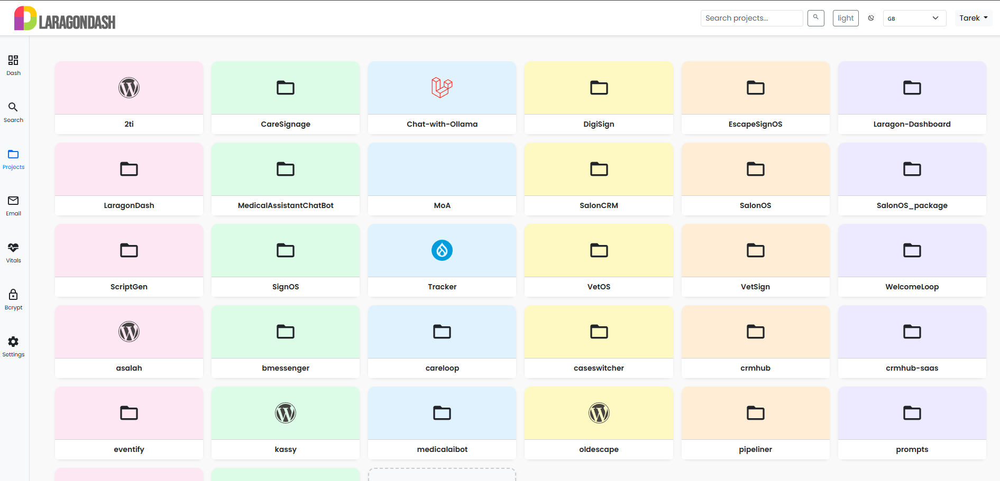

#  LaragonDash

## 🚀 Welcome to LaragonDash

**LaragonDash** is the natural evolution of the
original [Laragon Dashboard](https://github.com/LebToki/Laragon-Dashboard). It’s **modular**, **future-proof**, and
built for developers who want speed, control, and an intuitive interface to manage their local stack.

---

> Following the success and adoption of the original Laragon Dashboard by the community, we’re proud to introduce
`LaragonDash`.
> This spin-off delivers a modern MVC-inspired layout, support for modules, improved theming, and smarter tooling —
> while still preserving the simplicity developers loved about the original.

> ⚙️ **LaragonDash** is fully compatible with Laragon 6+ and will continue to receive updates and improvements as the
> new primary branch of development.

---

💡 **Prefer the classic look?**  
The original [Laragon Dashboard](https://github.com/LebToki/Laragon-Dashboard) will remain available in its current
form.  
Users who prefer the traditional layout can continue using it until the end of the year, while all future development
and new features will be released under **LaragonDash**.

---




---

## 🧩 Modular System

LaragonDash is structured as **modular** components under `/modules/` allowing you to plug and play:

- 🔍 **Search** – Quickly find your projects
- 📬 **Mail Viewer** – Read your local test emails
  @@ -67,63 +67,74 @@ You can also build and register your own modules!
  $domainSuffix = '.local';
  $ignore_dirs = array('.', '..', 'logs', 'access-logs', 'vendor', 'favicon_io', 'assets');

```

4. Update mailbox path in .env or config.php:

```php
define('SENDMAIL_OUTPUT_DIR', '/path/to/laragon/tmp');
```

### Enjoy a smoother local development experience!

📂 Module Directory Structure
LaragonDash/
├── assets/
├── includes/
├── modules/
│ ├── search/
│ ├── mail/
│ ├── bcrypt/
│ └── vitals/
├── index.php
└── README.md

📆 Changelog Summary
v1.1 — June 2025
<details>
<summary>Version 1.2 – June 19, 2025</summary>

- Language Loading and Selection: Added functionality to load language files and detect user language preference.
- Server Status Display: Added functions to display server uptime, memory usage, and disk usage.
- Query Parameter Handling: Improved handling of incoming query parameters.
- PHP and Apache Extension Retrieval: Added functionality to retrieve PHP extensions and Apache modules.
- PHP Version Checking: Fetches the latest PHP version and compares it with the current version running on the server.
- Server Information Retrieval: Gathers information about the server environment, including versions of HTTP server, OpenSSL, PHP, and Xdebug.
- MySQL Version Retrieval: Added function to retrieve the MySQL version.
- PHP Download Links: Generates download and changelog links for specific PHP versions.
- Site Directory Determination: Determines the directory path for server-specific site configuration based on the server software.
- WordPress Core Update Detection: Added functionality to detect if WordPress has any updates. (Plugins and Themes in the next version)
- Local Sites Retrieval: Fetches configuration details for local sites based on server configuration files.
- HTML Links Rendering: Renders HTML links for local sites with XSS prevention and includes control buttons for starting and stopping applications.

</details>

<details>
<summary>Version 1.1 – June 2025</summary>

Language loader with RTL support
Dynamic language dropdown with emoji flags
Fallback to English if translation missing
Tajawal font used automatically for Arabic
Settings page to edit ignored directories
Email viewer handles HTML/TXT and delete
Bcrypt generator with verify helper
Search results ranked by relevance
Vitals charts auto refresh

v1.0 — June 2025
</details>

<details>
<summary>Version 1.0 – June 2025</summary>

Initial modular release
Theme toggle with persistent mode
Sidebar + Navbar toggle with icons
WordPress auto-admin link
Search module with live filter
System Vitals with CPU + memory + uptime
Bcrypt Generator Tool
Improved code structure and error handling
Multi-language JSON structure for UI

</details>

🗣 Language Support
All translations reside in `assets/languages/`. Want to contribute your own? Simply add a `code.json` file with:
Currently bundled languages:

```
ar.json
de.json
en.json
es.json
fr.json
hi.json
id.json
ja.json
ko.json
pt.json
pt-BR.json
ru.json
tr.json
tl.json
ur.json
vi.json
zh-CN.json
```

Want to contribute a new one? Simply add a `code.json` file with:

```
{
  "Dashboard": "Dashboard",
  "Search": "Search",
  "Projects": "Projects"
}
```

⭐ Get Involved
⭐ Star the repo to show support
🛠 Fork and contribute modules or enhancements
🗣 Join Discussions to shape the future
🌍 Help translate the UI

📜 License
This project is licensed under the Attribution License.
This work by Tarek Tarabichi is licensed under
CC BY 4.0

💙 Credits
Made with 💙 by Tarek Tarabichi
Part of the growing tools family: Laragon Dashboard · LaragonDash · SignOS · CRMHub · bMessenger
