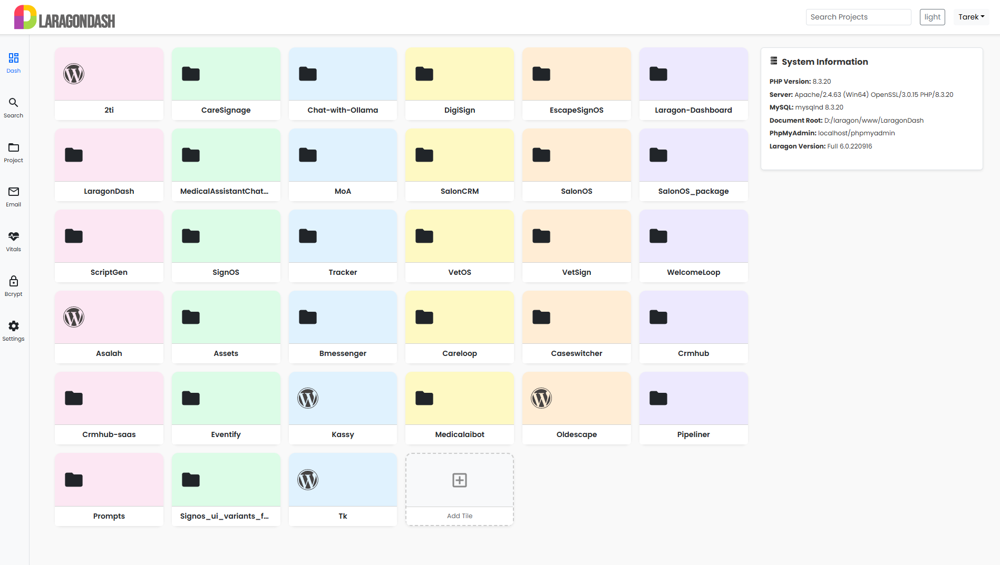
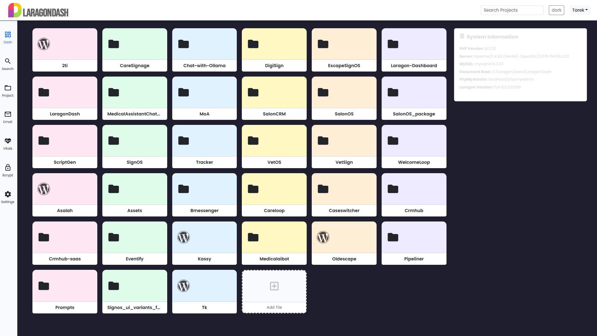
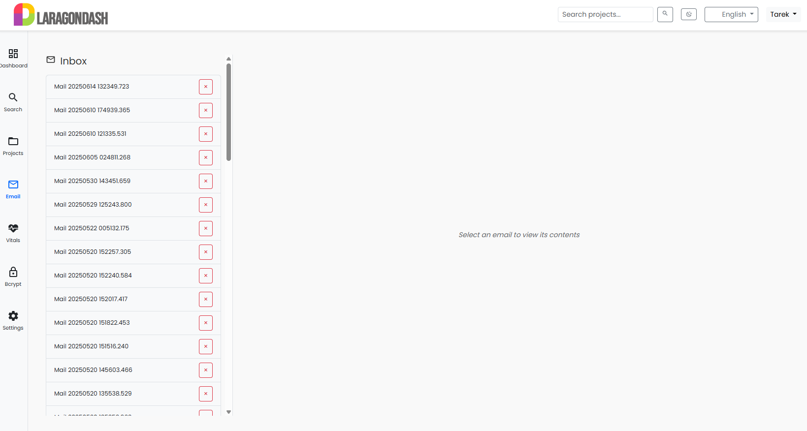

#  LaragonDash

## 🚀 Welcome to LaragonDash v1.0


**LaragonDash** is the natural evolution of the original [Laragon Dashboard](https://github.com/LebToki/Laragon-Dashboard). It’s **modular**, **future-proof**, and built for developers who want speed, control, and an intuitive interface to manage their local stack.

---

> Following the success and adoption of the original Laragon Dashboard by the community, we’re proud to introduce `LaragonDash v1.0`.  
> This spin-off delivers a modern MVC-inspired layout, support for modules, improved theming, and smarter tooling — while still preserving the simplicity developers loved about the original.

> ⚙️ **LaragonDash** is fully compatible with Laragon 6+ and will continue to receive updates and improvements as the new primary branch of development.

---

💡 **Prefer the classic look?**  
The original [Laragon Dashboard](https://github.com/LebToki/Laragon-Dashboard) will remain available in its current form.  
Users who prefer the traditional layout can continue using it until the end of the year, while all future development and new features will be released under **LaragonDash**.

---







---

## 🧩 Modular System
LaragonDash is structured as **modular** components under `/modules/` allowing you to plug and play:

- 🔍 **Search** – Quickly find your projects
- 📬 **Mail Viewer** – Read your local test emails
- 🧮 **Bcrypt Hash Generator** – Securely hash passwords
- 🖥 **System Vitals** – View CPU, memory, and uptime info
- 🌐 **Project Detection** – Auto-detect WordPress, Laravel, Symfony, Python, and more

You can also build and register your own modules!

---

## ✨ Key Features

| Feature | Description |
|--------|-------------|
| 🔗 Auto-detect projects | Detects local Laravel, WordPress, Python, and other frameworks. |
| 🌙 Light/Dark Theme | Switch themes seamlessly via the built-in toggle. |
| 💬 Language Support | JSON-based translation support for `en`, `de`, `fr`, `pt`, `es`, `tl`. |
| 🧠 Server Vitals | Memory, disk, PHP version, MySQL, and more. |
| 📬 Mailbox Viewer | View sent emails from local apps (sendmail/log viewer). |
| 🔒 Hash Tool | Instantly generate bcrypt hashes. |
| 📁 Ignore Directories | Customize hidden folders with `$ignore_dirs`. |
| 📱 Responsive Design | Optimized for all screens. |
| ⚙️ Easy Customization | Modify modules and helpers without touching core. |

---

## 🚀 Installation

1. Backup and replace your current Laragon `index.php` with the one in this repo.
2. Copy the `/assets/` and `/modules/` folders to your Laragon root.
3. Adjust your settings in `includes/settings.php`.

```php
$domainSuffix = '.local';
$ignore_dirs = array('.', '..', 'logs', 'access-logs', 'vendor', 'favicon_io', 'assets');
```

4. Update mailbox path in .env or config.php:

```php
define('SENDMAIL_OUTPUT_DIR', '/path/to/laragon/tmp');
```

### Enjoy a smoother local development experience!

📂 Module Directory Structure
LaragonDash/
├── assets/
├── includes/
├── modules/
│   ├── search/
│   ├── mail/
│   ├── bcrypt/
│   └── vitals/
├── index.php
└── README.md

📆 Changelog Summary
v1.0 — June 2025
Initial modular release
Theme toggle with persistent mode
Sidebar + Navbar toggle with icons
WordPress auto-admin link
Search module with live filter
System Vitals with CPU + memory + uptime
Bcrypt Generator Tool
Improved code structure and error handling
Multi-language JSON structure for UI

🗣 Language Support
All translations reside in /lang/. Want to contribute your own? Simply add a language-code.json file with:

```
{
  "Dashboard": "Dashboard",
  "Search": "Search",
  "Projects": "Projects"
}
```

⭐ Get Involved
 ⭐ Star the repo to show support
 🛠 Fork and contribute modules or enhancements
 🗣 Join Discussions to shape the future
 🌍 Help translate the UI

📜 License
This project is licensed under the Attribution License.
This work by Tarek Tarabichi is licensed under
CC BY 4.0


💙 Credits
Made with 💙 by Tarek Tarabichi
Part of the growing tools family: Laragon Dashboard · LaragonDash · SignOS · CRMHub · bMessenger

2025 · Tarek Tarabichi · Powered by 2TInteractive
