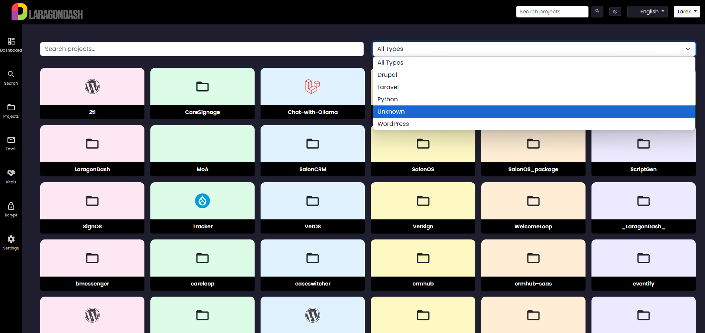
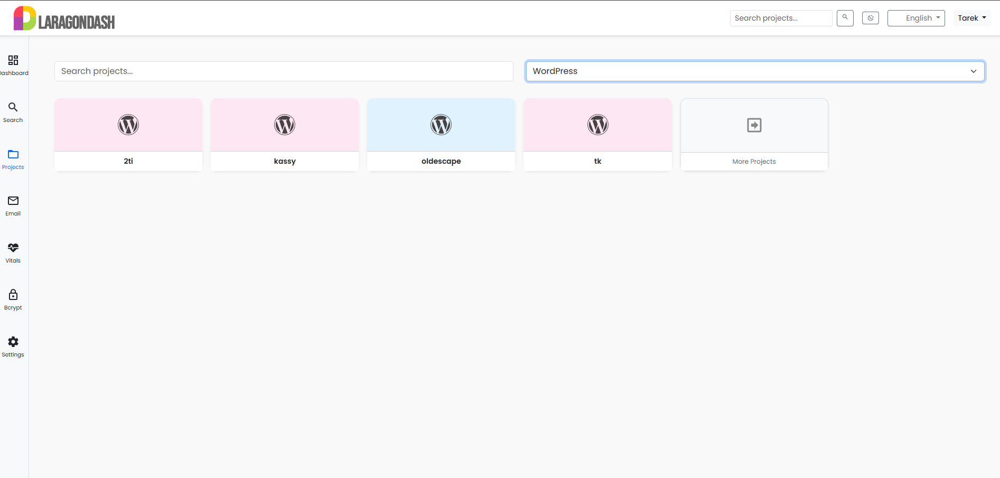
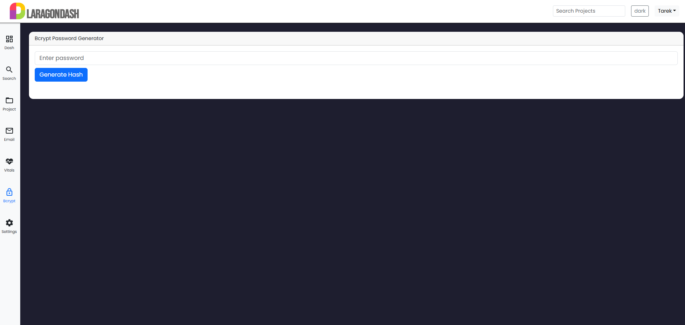

#  **LaragonDash**

> 🚀 A modern, modular, multilingual dashboard for Laragon 6+ - 7+ and 8+  
> Built for developers who want more clarity, control, and customization.

---

## ✨ What is LaragonDash?

**LaragonDash** is a powerful evolution of the original [Laragon Dashboard](https://github.com/LebToki/Laragon-Dashboard) — redesigned for the future. It keeps everything developers loved, but adds:

- ✅ **Modular system** for plug-and-play tools
- ✅ **Live language switching** (RTL/LTR support)
- ✅ **Modern UI/UX with theming**
- ✅ **No database required**

```txt
Compatible with Laragon 6+ - 7+ and 8+ • PHP 7+ - 8+ • Apache/Nginx • Lightweight & open source
```

---

> ⚙️ LaragonDash is the new primary branch for updates.  
> The original dashboard will remain available for legacy users until end of 2025.

---
# 

# 

# 


---

## 🧩 Modular Architecture

All modules are located in `/modules/`. Drop in your own tools or clone from the growing library:

| Module         | Description                         |
|----------------|-------------------------------------|
| 🔍 **Search**    | Live filter across project tiles    |
| 📬 **Email**     | Read/send/delete HTML & TXT mails   |
| 🧪 **Bcrypt**    | Encrypt + verify hashes securely    |
| ❤️ **Vitals**    | CPU, memory, disk & uptime monitor  |
| ⚙️ **Settings**  | Customize ignored dirs, default lang |
| 🗂 **Projects**  | Auto-detect WordPress, Laravel, etc |

```php
LaragonDash/
├── assets/
├── includes/
├── modules/
│   ├── bcrypt/
│   ├── email/
│   ├── search/
│   ├── settings/
│   └── vitals/
├── index.php
└── README.md
```

---

## 🌐 Language Support

> All translations reside in `/includes/languages/`  
> Add your own `xx.json` to contribute!

| Code   | Language             | Flag |
|--------|----------------------|------|
| `en`   | English              | 🇬🇧   |
| `fr`   | French               | 🇫🇷   |
| `es`   | Spanish              | 🇪🇸   |
| `de`   | German               | 🇩🇪   |
| `pt`   | Portuguese           | 🇵🇹   |
| `pt-BR`| Brazilian Portuguese | 🇧🇷   |
| `ar`   | Arabic (RTL)         | 🇸🇦   |
| `ur`   | Urdu (RTL)           | 🇵🇰   |
| `hi`   | Hindi                | 🇮🇳   |
| `tl`   | Tagalog              | 🇵🇭   |
| `id`   | Indonesian           | 🇮🇩   |
| `tr`   | Turkish              | 🇹🇷   |
| `ru`   | Russian              | 🇷🇺   |
| `ja`   | Japanese             | 🇯🇵   |
| `ko`   | Korean               | 🇰🇷   |
| `vi`   | Vietnamese           | 🇻🇳   |
| `zh-CN`| Simplified Chinese   | 🇨🇳   |

---

## 🗓️ Changelog Summary

<details>
<summary><strong>v1.2 – June 19, 2025</strong></summary>

- 🔄 Language auto-detection + RTL direction
- 🌍 Flag dropdown with live translations
- 🛠 Server vitals (CPU/RAM/Disk) module
- ⏳ PHP + Apache version inspection
- ⚙️ Modular bootstrap with dynamic includes
- 🧪 WordPress core version + update checker
</details>

<details>
<summary><strong>v1.1 – June 2025</strong></summary>

- ✨ Mail reader UI with toggle/delete
- 🔒 Bcrypt hasher with dual verify mode
- 🌓 Light/Dark theme toggle with memory
- 🔍 Search tile filtering
- ⚙️ Settings with directory ignore control
</details>

<details>
<summary><strong>v1.0 – Initial Release</strong></summary>

- 📦 Modular MVC structure
- 🎨 Modern dashboard layout
- 📂 Auto-detect WordPress/Laravel/etc.
- 🌐 Multilingual foundation
</details>

---

## 💻 How to Add a New Language

Just drop a new JSON file inside `/assets/languages/` named `xx.json`.  
Here’s a quick example for `xx.json`:

```json
{
  "navigation": {
    "dashboard": "Dashboard",
    "search": "Search",
    "projects": "Projects"
  },
  "buttons": {
    "logout": "Logout",
    "save": "Save"
  }
}
```

✅ It will be picked up automatically in the language dropdown!  
✅ Arabic/Urdu will trigger RTL mode with `Tajawal` or `Noto Nastaliq Urdu`.

---

## 🛠 Developers

Want to contribute your own module?

Just create:

```bash
/modules/yourtool/
├── index.php
├── style.css
├── script.js

```

Optional: include a `lang.json` file inside your module to localize text.  
Use `data-i18n="module.key"` for inline translations.

---

## 🌍 Get Involved

⭐ Star the repo  
🛠 Submit your own module  
🧠 Join discussions  
🗣 Help translate

---

## 📄 License

This project is licensed under the **Creative Commons Attribution 4.0** license (CC BY 4.0).  
Made with 💙 by [Tarek Tarabichi](https://2tinteractive.com)

Part of the toolset: **LaragonDash**, **CRMHub**, **bMessenger**, **SignOS**
